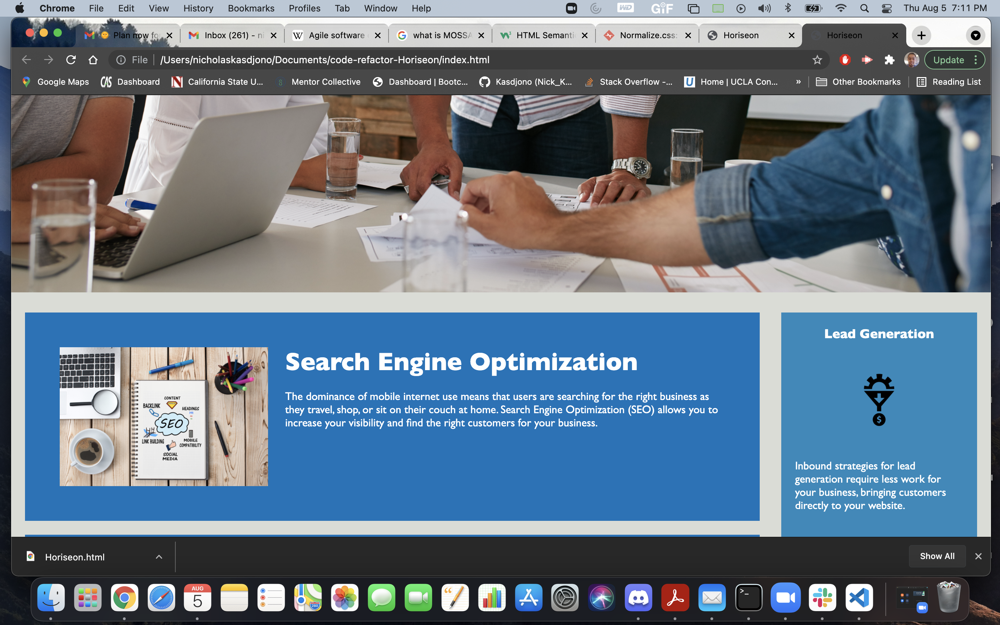
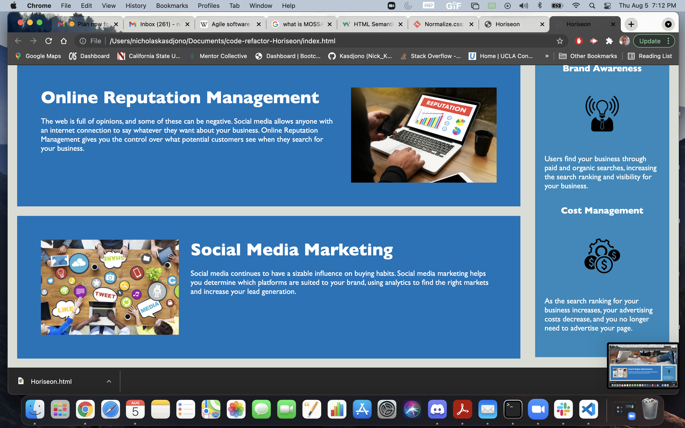
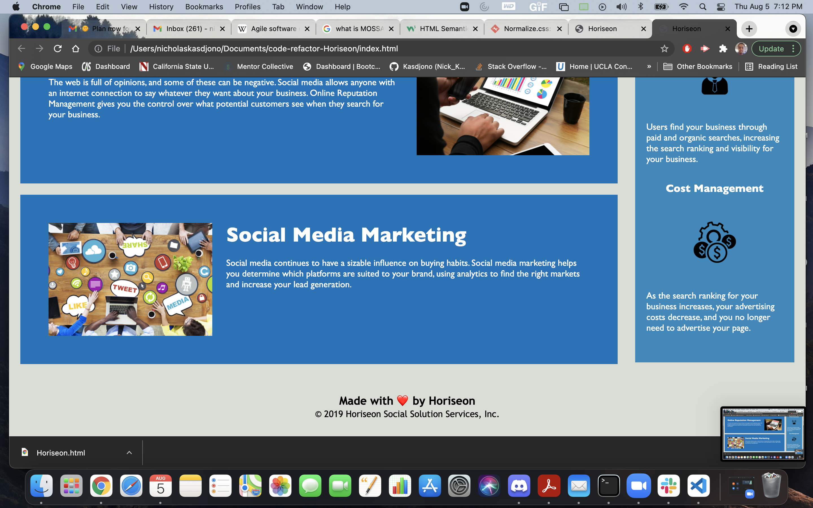

# code-refactor-Horiseon
 

## This is an updated refactor to the Horiseon webpage, improving accessibility and efficiency
 
 

## The following features have been added to the code :
 

## changed title to "Horiseon"
 

## created a "header"  section

        - inside header section I added "nav" section
 

## created a "section"/"article" section for the main content:

        - search engine optimization
        - online reputation  management
        - social media  marketing
 

## created a "section"/"aside" section for the benefits content:

        - lead generation
        - brand awareness
        - cost management
 

## combined the "attributes" for the following content in css:

        - class="content-atribute"
                - .benefit-lead, .benefit-brand, .benefit-cost 
                - .benefit-lead h3, .benefit-brand h3, .benefit-cost h3
                - .benefit-lead img, .benefit-brand img, .benefit-cost img

        - class="benefit-attribute"
                - .search-engine-optimization, .online-reputation-management, .social-media-marketing
                - .search-engine-optimization img, .online-reputation-management img, .social-media-marketing img
                - .search-engine-optimization h2, .online-reputation-management h2, .social-media-marketing h2
 

## fixed the "search engine optimization" function in the nav bar @ top of screen 

        - added an "id" function that links the search engine optimization
          section to the link in the nav bar
 

## adjused code for the large image for the uppper half of the screen

        - put the source for the image in html file instead of css file 
        - changed it to "figure" instead of "div"
 

## added alternative text messages for all images
 

